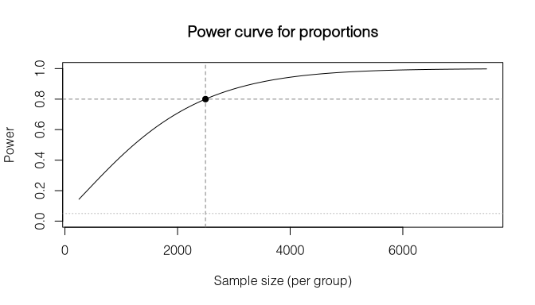

# svyplan

Survey sample size determination, precision analysis, optimal
allocation, stratification, and power analysis for R.

## Installation

``` r
# From GitLab
pak::pkg_install("gitlab::dickoa/svyplan")
```

## Sample sizes

``` r
library(svyplan)

# Proportion with margin of error
n_prop(p = 0.3, moe = 0.05)
#> Sample size for proportion (wald)
#> n = 323 (p = 0.30, moe = 0.050)

# Mean with finite population and design effect
n_mean(var = 100, moe = 2, N = 5000, deff = 1.5)
#> Sample size for mean
#> n = 142 (var = 100.00, moe = 2.000, deff = 1.50)
```

### Response rate adjustment

All functions accept a `resp_rate` parameter. The sample size is
inflated by `1 / resp_rate` to account for expected non-response:

``` r
n_prop(p = 0.3, moe = 0.05, deff = 1.5, resp_rate = 0.8)
#> Sample size for proportion (wald)
#> n = 606 (net: 485) (p = 0.30, moe = 0.050, deff = 1.50, resp_rate = 0.80)
```

## Precision analysis

Given a sample size, how precise will your estimates be? The `prec_*()`
functions are the inverse of `n_*()`:

``` r
prec_prop(p = 0.3, n = 400)
#> Sampling precision for proportion (wald)
#> n = 400
#> se = 0.0229, moe = 0.0449, cv = 0.0764

prec_mean(var = 100, n = 400, mu = 50)
#> Sampling precision for mean
#> n = 400
#> se = 0.5000, moe = 0.9800, cv = 0.0100
```

### Round-trip between size and precision

All `n_*()` and `prec_*()` functions are S3 generics. Pass a precision
result to `n_*()` to recover the sample size, or pass a sample size
result to `prec_*()` to compute the achieved precision:

``` r
# Start with a precision target
s <- n_prop(p = 0.3, moe = 0.05, deff = 1.5)

# What precision does this n achieve?
p <- prec_prop(s)
p
#> Sampling precision for proportion (wald)
#> n = 485
#> se = 0.0255, moe = 0.0500, cv = 0.0850

# Recover the original n
n_prop(p)
#> Sample size for proportion (wald)
#> n = 485 (p = 0.30, moe = 0.050, deff = 1.50)
```

## Multi-indicator surveys

Household surveys track many indicators at once. `n_multi()` finds the
sample size that satisfies all precision targets simultaneously.

``` r
targets <- data.frame(
  name = c("stunting", "vaccination", "anemia"),
  p    = c(0.25, 0.70, 0.12),
  moe  = c(0.05, 0.05, 0.03),
  deff = c(2.0, 1.5, 2.5)
)

n_multi(targets)
#> Multi-indicator sample size
#> n = 1127 (binding: anemia)
#> ---
#>  name        .n   .binding
#>  stunting     577         
#>  vaccination  485         
#>  anemia      1127 *
```

Per-domain optimization works by adding domain columns to the targets
data frame.

## Multistage cluster designs

``` r
# Optimal 2-stage allocation within a budget
n_cluster(cost = c(500, 50), delta = 0.05, budget = 100000)
#> Optimal 2-stage allocation
#> n_psu = 85 | psu_size = 14 -> total n = 1190 (unrounded: 1159)
#> cv = 0.0376, cost = 100000

# Precision for a given allocation
prec_cluster(n = c(50, 12), delta = 0.05)
#> Sampling precision for 2-stage cluster
#> n_psu = 50 | psu_size = 12 -> total n = 600
#> cv = 0.0508
```

Variance components can be estimated from frame data and passed directly
to `n_cluster()`:

``` r
set.seed(1)
frame <- data.frame(
  district = rep(1:40, each = 20),
  income = rep(rnorm(40, 500, 100), each = 20) + rnorm(800, 0, 50)
)

vc <- varcomp(income ~ district, data = frame)
vc
#> Variance components (2-stage)
#> varb = 0.0307, varw = 0.0105
#> delta = 0.7448
#> k = 1.0311
#> Unit relvariance = 0.0400

n_cluster(cost = c(500, 50), delta = vc, cv = 0.05)
#> Optimal 2-stage allocation
#> n_psu = 15 | psu_size = 2 -> total n = 30 (unrounded: 26)
#> cv = 0.0500, cost = 8635
```

## Sensitivity analysis

`predict()` evaluates a result at new parameter combinations, returning
a data frame suitable for plotting:

``` r
x <- n_prop(p = 0.3, moe = 0.05, deff = 1.5)
predict(x, expand.grid(
  deff = c(1, 1.5, 2, 2.5),
  resp_rate = c(0.7, 0.8, 0.9, 1.0)
))
#>    deff resp_rate         n         se  moe         cv
#> 1   1.0       0.7  460.9751 0.02551067 0.05 0.08503558
#> 2   1.5       0.7  691.4626 0.02551067 0.05 0.08503558
#> 3   2.0       0.7  921.9501 0.02551067 0.05 0.08503558
#> 4   2.5       0.7 1152.4376 0.02551067 0.05 0.08503558
#> 5   1.0       0.8  403.3532 0.02551067 0.05 0.08503558
#> 6   1.5       0.8  605.0298 0.02551067 0.05 0.08503558
#> 7   2.0       0.8  806.7064 0.02551067 0.05 0.08503558
#> 8   2.5       0.8 1008.3829 0.02551067 0.05 0.08503558
#> 9   1.0       0.9  358.5362 0.02551067 0.05 0.08503558
#> 10  1.5       0.9  537.8042 0.02551067 0.05 0.08503558
#> 11  2.0       0.9  717.0723 0.02551067 0.05 0.08503558
#> 12  2.5       0.9  896.3404 0.02551067 0.05 0.08503558
#> 13  1.0       1.0  322.6825 0.02551067 0.05 0.08503558
#> 14  1.5       1.0  484.0238 0.02551067 0.05 0.08503558
#> 15  2.0       1.0  645.3651 0.02551067 0.05 0.08503558
#> 16  2.5       1.0  806.7064 0.02551067 0.05 0.08503558
```

Works for all object types: sample size, precision, cluster, and power.

## Strata boundaries

`strata_bound()` finds optimal boundaries for a continuous
stratification variable.

``` r
set.seed(1)
x <- rlnorm(5000, meanlog = 6, sdlog = 1.2)

strata_bound(x, n_strata = 4, n = 300, method = "cumrootf")
#> Strata boundaries (Dalenius-Hodges, 4 strata)
#> Boundaries: 400.0, 1300.0, 3300.0
#> n = 300, cv = 0.0211
#> Allocation: neyman
#> ---
#>  stratum lower      upper    N_h  W_h   S_h    n_h
#>  1          4.92557   400.00 2523 0.505 107.1   44
#>  2        400.00000  1300.00 1610 0.322 250.3   66
#>  3       1300.00000  3300.00  647 0.129 544.0   58
#>  4       3300.00000 39039.61  220 0.044 3675.1 132
```

Four methods are available: Dalenius-Hodges (`"cumrootf"`), geometric
(`"geo"`), Lavallee-Hidiroglou (`"lh"`), and Kozak (`"kozak"`).

## Power analysis

Solve for sample size, power, or minimum detectable effect. Supports
design effects, finite population correction, response rate adjustment,
and panel overlap.

``` r
# Sample size to detect a 5pp change from 70% with deff = 2
power_prop(p1 = 0.70, p2 = 0.75, deff = 2.0)
#> Power analysis for proportions (solved for sample size)
#> n = 2496 (per group), power = 0.800, effect = 0.0500
#> (p1 = 0.700, p2 = 0.750, alpha = 0.05, deff = 2.00)

# MDE with n = 1500 per group
power_prop(p1 = 0.70, n = 1500, deff = 2.0)
#> Power analysis for proportions (solved for minimum detectable effect)
#> n = 1500 (per group), power = 0.800, effect = 0.0639
#> (p1 = 0.700, p2 = 0.764, alpha = 0.05, deff = 2.00)

# Means
power_mean(effect = 5, var = 200)
#> Power analysis for means (solved for sample size)
#> n = 126 (per group), power = 0.800, effect = 5.0000
#> (alpha = 0.05)
```

`plot()` draws the power-vs-sample-size curve with reference lines at
the solved point:

``` r
pw <- power_prop(p1 = 0.70, p2 = 0.75, power = 0.80, deff = 2.0)
plot(pw)
```

<!-- -->

## Design effects

``` r
# Planning: expected cluster design effect
design_effect(delta = 0.05, psu_size = 20, method = "cluster")
#> [1] 1.95

# Diagnostic: Kish design effect from weights
set.seed(1)
w <- runif(500, 0.5, 4)
design_effect(w, method = "kish")
#> [1] 1.196494
effective_n(w, method = "kish")
#> [1] 417.8876
```

## References

Cochran, W. G. (1977). *Sampling Techniques* (3rd ed.). Wiley.

Kish, L. (1965). *Survey Sampling*. Wiley.

Valliant, R., Dever, J. A., and Kreuter, F. (2018). *Practical Tools for
Designing and Weighting Survey Samples* (2nd ed.). Springer.
