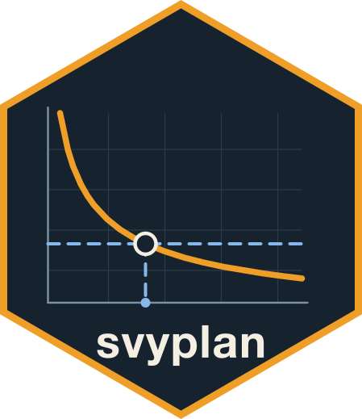
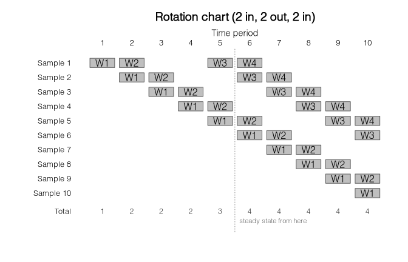
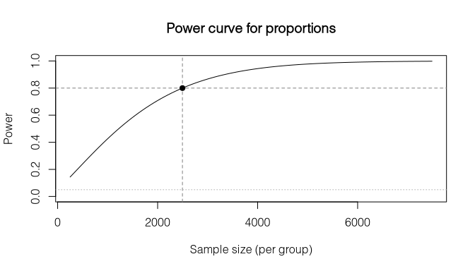

# svyplan 

<!-- badges: start -->

[](https://CRAN.R-project.org/package=svyplan)
[](https://gitlab.com/dickoa/svyplan/-/pipelines)
[](https://app.codecov.io/gl/dickoa/svyplan?branch=main)
<!-- badges: end -->

Survey sample size determination, precision analysis, optimal and joint
multivariate/multidomain allocation, stratification, and power analysis
for R.

svyplan stops at the plan. It decides how many units, allocated where,
to what precision, and it never draws a sample: no selection
probabilities, no weights, no drawn units come out of any function here.
When the plan is settled,
[sondage](https://cran.r-project.org/package=sondage) draws it.

## Which function

Eleven problems, each with the function or pair that answers it. Every
`n_` has a `prec_` reading the same design back the other way, so a row
names one thing to learn rather than two.

| **I want to size, or evaluate** | **Functions** |
|:---|:---|
| a proportion, a mean or a ratio of two totals | `n_prop()`/`prec_prop()`, `n_mean()`/`prec_mean()`, `n_ratio()`/`prec_ratio()` |
| several indicators at once, taking the most demanding | `n_multi()`/`prec_multi()` |
| a two- or three-stage cluster design, for one indicator or a table of them | `n_cluster()`/`prec_cluster()` |
| an allocation across strata or domains, under a budget or a CV target | `n_alloc()`/`prec_alloc()`, `strata_bound()` |
| a two-phase design that screens or follows up | `n_twophase()`/`prec_twophase()` |
| a change between two occasions of a repeated survey | `n_change()`/`prec_change()` |
| the average of several occasions of a repeated survey | `n_pooled()`/`prec_pooled()` |
| a panel that must still deliver a sample after attrition | `n_panel()`/`prec_panel()` |
| the overlap and field schedule a rotation pattern produces | `design_rotation()`, `design_overlap()`, `design_schedule()` |
| the power of a two-group comparison or a difference-in-differences | `power_prop()`, `power_mean()`, `power_did()` |
| the design effect, effective size or degrees of freedom of a plan | `design_effect()`, `effective_n()`, `design_df()`, `varcomp()` |

## Installation

``` r
# From GitLab
pak::pkg_install("gitlab::dickoa/svyplan")
```

## Sample sizes

``` r
library(svyplan)

# Proportion with margin of error
n_prop(p = 0.3, moe = 0.05)
#> Sample size for proportion (wald)
#> n = 323 (p = 0.30, moe = 0.050, deff = 1)
#> expected cases = 96.8

# Mean with finite population and design effect
n_mean(var = 100, moe = 2, N = 5000, deff = 1.5)
#> Sample size for mean
#> n = 141 (var = 100.00, moe = 2.000, deff = 1.50)
```

### Ratios of two totals

Some headline indicators are a ratio of two totals estimated from the
same sample, such as consumption per person or yield per hectare.
`n_ratio()` sizes for the ratio itself, taking the anticipated ratio,
each component’s coefficient of variation, and their correlation across
units:

``` r
n_ratio(r = 420, cv_num = 1.20, cv_den = 0.45, component_cor = 0.65,
        cv = 0.05)
#> Sample size for ratio (linearization)
#> n = 377 (r = 420, unit_relvar = 0.941, cv = 0.050, deff = 1)
```

The correlation between the components is what makes a ratio precise. A
numerator that moves with its denominator gives a stable ratio even when
both components are individually variable, and the printed `unit_relvar`
is the coefficient the size turns on. For a clustered design the
homogeneity that matters belongs to the linearized variable `y - r * x`
rather than to either component, and `vignette("svyplan")` works that
bridge through.

### Response rate adjustment

Most sizing and precision functions accept `resp_rate`. In sample-size
mode, the required sample is inflated by `1 / resp_rate` to account for
expected non-response:

``` r
n_prop(p = 0.3, moe = 0.05, deff = 1.5, resp_rate = 0.8)
#> Sample size for proportion (wald)
#> n = 606 gross (net: 485) (p = 0.30, moe = 0.050, deff = 1.50, resp_rate = 0.80)
#> expected cases = 145.2
```

### Survey plan profiles

When the same design parameters apply across many calls, bundle them
into a `svyplan()` profile:

``` r
plan <- svyplan(deff = 1.5, resp_rate = 0.85, N = 50000)

# Pass as argument
n_prop(p = 0.3, moe = 0.05, plan = plan)
#> Sample size for proportion (wald)
#> n = 564 gross (net: 480) (p = 0.30, moe = 0.050, deff = 1.50, resp_rate = 0.85)
#> expected cases = 143.8

# Or pipe (positional or named args)
plan |> n_mean(100, moe = 2)
#> Sample size for mean
#> n = 169 gross (net: 144) (var = 100.00, moe = 2.000, deff = 1.50, resp_rate = 0.85)
plan |> n_mean(var = 100, moe = 2)
#> Sample size for mean
#> n = 169 gross (net: 144) (var = 100.00, moe = 2.000, deff = 1.50, resp_rate = 0.85)

# Explicit args always override plan defaults
n_prop(p = 0.3, moe = 0.05, plan = plan, deff = 2.0)
#> Sample size for proportion (wald)
#> n = 750 gross (net: 638) (p = 0.30, moe = 0.050, deff = 2.00, resp_rate = 0.85)
#> expected cases = 191.1
```

## Precision analysis

Given a sample size, how precise will your estimates be? The `prec_*()`
functions are the inverse of `n_*()`:

``` r
prec_prop(p = 0.3, n = 400)
#> Sampling precision for proportion (wald)
#> n = 400
#> se = 0.0229, moe = 0.0449, cv = 0.0764, rmoe = 0.1497
#> expected cases = 120.0

prec_mean(var = 100, n = 400, mu = 50)
#> Sampling precision for mean
#> n = 400
#> se = 0.5000, moe = 0.9800, cv = 0.0100, rmoe = 0.0196
```

### Round-trip between size and precision

All `n_*()` and `prec_*()` functions are S3 generics. Pass a precision
result to `n_*()` to recover the sample size, or pass a sample size
result to `prec_*()` to compute the achieved precision:

``` r
# Start with a precision target
s <- n_prop(p = 0.3, moe = 0.05, deff = 1.5)

# What precision does this n achieve?
p <- prec_prop(s)
p
#> Sampling precision for proportion (wald)
#> n = 485
#> se = 0.0255, moe = 0.0500, cv = 0.0850, rmoe = 0.1667
#> expected cases = 145.2

# Recover the original n
n_prop(p)
#> Sample size for proportion (wald)
#> n = 485 (p = 0.30, moe = 0.050, deff = 1.50)
#> expected cases = 145.2
```

## Multi-indicator surveys

Household surveys track many indicators at once. `n_multi()` finds the
sample size that satisfies all precision targets simultaneously.

``` r
targets <- data.frame(
  name = c("stunting", "vaccination", "anemia"),
  p    = c(0.25, 0.70, 0.12),
  moe  = c(0.05, 0.05, 0.03),
  deff = c(2.0, 1.5, 2.5)
)

n_multi(targets)
#> Multi-indicator sample size
#> n = 1127 (binding: anemia)
#> 
#>  name        .n   .cv_target .cv_achieved .binding
#>  stunting     577 0.10204269 0.07297042           
#>  vaccination  485 0.03644382 0.02388518           
#>  anemia      1127 0.12755336 0.12755336   *
```

Per-domain optimization works by specifying domain columns via the
`domains` parameter.

### Relative precision in MICS and DHS

UNICEF’s MICS states a precision requirement as a **relative margin of
error**, the margin of error as a fraction of the indicator. State it
directly with `rmoe`. DHS states one as a **relative standard error**,
which is `cv`. The vignette describes both programs and cites the
sampling rules each publishes.

``` r
targets_rmoe <- data.frame(
  name = c("stunting", "vaccination", "anemia"),
  p    = c(0.25, 0.70, 0.12),
  rmoe = 0.12,
  deff = c(2.0, 1.5, 2.5)
)

n_multi(targets_rmoe)
#> Multi-indicator sample size
#> n = 4891 (binding: anemia)
#> 
#>  name        .n   .cv_target .cv_achieved .binding
#>  stunting    1601 0.06122561 0.03502580           
#>  vaccination  172 0.06122561 0.01146488           
#>  anemia      4891 0.06122561 0.06122561   *
```

The MICS template reports sample size in **households**. svyplan returns
the number of **individuals** in the target population. To convert,
divide by the expected number of eligible individuals per household:
`n_hh = ceiling(n / (pb * hh_size))`, where `pb` is the share of the
target population and `hh_size` is the average household size.

## Multistage cluster designs

``` r
# Optimal 2-stage allocation within a budget
n_cluster(stage_cost = c(500, 50), icc = 0.05, budget = 100000)
#> Optimal 2-stage allocation
#> field design: n_psu = 80 | n_per_psu = 15 -> total n = 1200
#> cv = 0.0376, cost = 100000
#> continuous optimum: n_psu = 84.08997 | n_per_psu = 13.78405 (cv = 0.0376, cost = 100000)
#> design df = 79

# Precision for a given allocation
prec_cluster(n = c(50, 12), icc = 0.05)
#> Sampling precision for 2-stage cluster
#> n_psu = 50 | n_per_psu = 12 -> total n = 600
#> cv = 0.0508
```

Variance components can be estimated from frame data and passed directly
to `n_cluster()`:

``` r
set.seed(104)
frame <- data.frame(
  district = rep(1:40, each = 20),
  income = rep(rnorm(40, 500, 100), each = 20) + rnorm(800, 0, 50)
)

vc <- varcomp(income ~ district, data = frame)
vc
#> Variance components (2-stage)
#> varb = 0.0255, varw = 0.0099
#> icc = 0.7210
#> var_ratio = 1.0317
#> Unit relvariance = 0.0343
as.data.frame(vc)
#>   stages       varb        varw       icc var_ratio unit_relvar
#> 1      2 0.02554834 0.009886668 0.7209915   1.03174   0.0343449

n_cluster(stage_cost = c(500, 50), icc = vc, cv = 0.05)
#> Optimal 2-stage allocation
#> field design: n_psu = 13 | n_per_psu = 2 -> total n = 26
#> cv = 0.0484, cost = 7800
#> continuous optimum: n_psu = 12.22966 | n_per_psu = 1.967178 (cv = 0.0500, cost = 7318)
#> design df = 12
```

`icc` is the survey-planning measure of homogeneity used by `varcomp()`,
`n_cluster()`, and `design_effect()`. It is not the same as a generic
mixed-model ICC, and values near 0 or 1 correspond to degenerate
boundary cases for the closed-form cluster optimizer.

## Sensitivity analysis

`predict()` evaluates a result at new parameter combinations, returning
a data frame suitable for plotting:

``` r
x <- n_prop(p = 0.3, moe = 0.05, deff = 1.5)
predict(x, expand.grid(
  deff = c(1, 1.5, 2, 2.5),
  resp_rate = c(0.7, 0.8, 0.9, 1.0)
))
#>    deff resp_rate         n         se  moe         cv      rmoe
#> 1   1.0       0.7  460.9751 0.02551067 0.05 0.08503558 0.1666667
#> 2   1.5       0.7  691.4626 0.02551067 0.05 0.08503558 0.1666667
#> 3   2.0       0.7  921.9501 0.02551067 0.05 0.08503558 0.1666667
#> 4   2.5       0.7 1152.4376 0.02551067 0.05 0.08503558 0.1666667
#> 5   1.0       0.8  403.3532 0.02551067 0.05 0.08503558 0.1666667
#> 6   1.5       0.8  605.0298 0.02551067 0.05 0.08503558 0.1666667
#> 7   2.0       0.8  806.7064 0.02551067 0.05 0.08503558 0.1666667
#> 8   2.5       0.8 1008.3829 0.02551067 0.05 0.08503558 0.1666667
#> 9   1.0       0.9  358.5362 0.02551067 0.05 0.08503558 0.1666667
#> 10  1.5       0.9  537.8042 0.02551067 0.05 0.08503558 0.1666667
#> 11  2.0       0.9  717.0723 0.02551067 0.05 0.08503558 0.1666667
#> 12  2.5       0.9  896.3404 0.02551067 0.05 0.08503558 0.1666667
#> 13  1.0       1.0  322.6825 0.02551067 0.05 0.08503558 0.1666667
#> 14  1.5       1.0  484.0238 0.02551067 0.05 0.08503558 0.1666667
#> 15  2.0       1.0  645.3651 0.02551067 0.05 0.08503558 0.1666667
#> 16  2.5       1.0  806.7064 0.02551067 0.05 0.08503558 0.1666667
```

Sensitivity analysis is available for single-indicator sample-size and
precision results, cluster designs, power analyses, and strata
boundaries. A joint constrained allocation sweeps the controls a plan
can still move: the fixed per-PSU take of a multistage design, and the
budget of a fixed-budget objective fit. Multi-indicator results are not
currently supported by `predict()`.

## Strata boundaries

`strata_bound()` constructs candidate boundaries for a continuous
stratification variable.

``` r
set.seed(905)
x <- rlnorm(5000, meanlog = 6, sdlog = 1.2)

strata_bound(x, n_strata = 4, n = 300, method = "cumrootf")
#> Strata boundaries (Dalenius-Hodges, 4 strata)
#> n = 300, cv = 0.0205, allocation: neyman
#> 
#>  stratum  lower upper    N share     sd   mean   n
#>        1 8.3804   400 2492 0.498  104.2  186.9  46
#>        2    400  1300 1647 0.329  246.5  724.4  71
#>        3   1300  3200  639 0.128  500.9 1946.0  56
#>        4   3200 28910  222 0.044 3264.3 5471.5 127
```

Four methods are available: Dalenius-Hodges (`"cumrootf"`), geometric
(`"geo"`), LH-inspired coordinate optimization (`"lh"`), and
Kozak-inspired random-restart local search (`"kozak"`). The latter two
are heuristics and do not claim global optimality or exact
implementation of the published algorithms.

## Two-phase designs

Phase 1 draws a large sample and measures a variable the frame does not
carry. Phase 2 subsamples those units and measures the variable of
interest on them. `n_twophase()` allocates both at once. The frame is
one row per phase-2 stratum, in the `n_alloc()` column vocabulary but on
a narrower contract, since `sd` is required where `n_alloc()` also
accepts `var`.

``` r
frame <- data.frame(
  stratum   = c("A", "B", "C", "D"),
  N         = c(3500, 2500, 2500, 1500),
  sd        = c(12, 25, 8, 40),
  mean      = c(40, 70, 35, 90),
  unit_cost = c(2, 5, 1, 9)
)

n_twophase(frame, phase1_cost = 1, budget = 50000)
#> Two-phase allocation (4 phase-2 strata)
#> field design: n_phase1 = 16924 | n_phase2 = 8094
#> cv = 0.0050, cost = 50000
#> 
#>  stratum share    sd unit_cost     nu n_int
#>        A 0.350 12.00      2.00 0.4154  2462
#>        B 0.250 25.00      5.00 0.5474  2316
#>        C 0.250  8.00      1.00 0.3917  1659
#>        D 0.150 40.00      9.00 0.6528  1657
#> 
#> single-phase is better here: n = 14085 at cv 0.0046, so skip phase 1
#> # summary() for the continuous optimum and the comparator
```

Nonresponse follow-up is the same problem with two strata: respondents
are already measured, so they cost nothing more and are all kept, and
only the nonrespondents are subsampled.

``` r
theta <- 0.5

nrfu <- data.frame(
  stratum   = c("respondents", "nonrespondents"),
  N         = c(theta, 1 - theta),
  sd        = c(1, 1),
  unit_cost = c(0, 200),
  take_all  = c(TRUE, FALSE)
)

n_twophase(nrfu, phase1_cost = 50, budget = 100000,
           mu = 1, single_cost = 50 / theta)
#> Two-phase allocation (2 phase-2 strata)
#> field design: n_phase1 = 828 | n_phase2 = 707
#> cv = 0.0382, cost = 1e+05
#> 
#>         stratum share   sd unit_cost     nu n_int take_all
#>     respondents 0.500 1.00      0.00 1.0000   414        *
#>  nonrespondents 0.500 1.00    200.00 0.7071   293         
#> 
#> single-phase is better here: n = 1000 at cv 0.0316, so skip phase 1
#> # summary() for the continuous optimum and the comparator
```

Neither phase has to be a simple random sample, and both can lose sample
to nonresponse. `phase1_deff` and `resp_rate` act on the between-stratum
component. `deff` and `resp_rate` frame columns act on each stratum’s
residual. `single_deff` and `single_resp_rate` describe the comparator.
Each divides its own component, so a single factor on the combined
variance would be the wrong model. Issued and expected-responding counts
are reported separately.

Every result carries the single-phase comparison, because two-phase
sampling is not always an improvement.

## Change and panel designs

The families above size one occasion. A survey that runs more than once
is sized against the change between two occasions, and, if the same
units are followed, against how many to recruit so that enough of them
are still responding later.

`n_change()` and `prec_change()` are the `n_*`/`prec_*` pair for a
change in a mean or a proportion. Measuring the same units twice needs
fewer of them than two independent rounds, because the change is a
difference and the unit-level correlation cancels part of its variance.
`overlap` is the share of the first occasion’s responding sample
measured again, `overlap_cor` the correlation among those shared units,
and only their product buys anything.

``` r
n_change(p = c(0.30, 0.36), moe = 0.02)
#> Sample size for change (proportion scale)
#> n = 4230 per occasion (p = 0.3 to 0.36, moe = 0.02, deff = 1)
#> No between-occasion covariance (overlap x overlap_cor = 0)

n_change(p = c(0.30, 0.36), moe = 0.02, overlap = 0.75, overlap_cor = 0.5)
#> Sample size for change (proportion scale)
#> n = 2646 per occasion (p = 0.3 to 0.36, moe = 0.02, deff = 1)
#> overlap = 0.75, overlap_cor = 0.5 (62.5% of the independent variance)
```

The overlap is a property of the design, fixed once the rotation is
declared. The correlation is a property of the variable and has to come
from a previous round of the same survey. `design_rotation()` declares
the design half once. Give it the occasions a unit spends in and out of
sample over its whole life, and `design_overlap()` returns the overlap
at every lag it reaches:

``` r
rotation <- design_rotation("4-8-4")
cps <- design_overlap(rotation)
cps[c(1, 12)]
#> [1] 0.75 0.50
```

Those are the two published CPS figures, 75 percent of the sample shared
between consecutive months and 50 percent between the same month a year
apart. A rotation is a finite life, not a repeating pattern, and reading
`"4-8-4"` as “four in, eight out, repeat” gives 87.5 percent instead.
Each lag is a different design question, so name the one the change
spans rather than passing the profile whole.

Two notations for a rotation are in print and both are accepted, told
apart by the `0`, which no spell can be. `"4-8-4"` counts occasions per
spell and `"1-1-0-0-1-1"` carries one flag per occasion, and is the same
life as `"2-2-2"`. A string of all 1s is a valid sentence in both and a
different design in each, so it is refused rather than resolved by
precedence: `"1-1-1"` is three consecutive occasions as a pattern and
in-out-in as spells, whose consecutive overlaps are 2/3 and 0. Write
`"3"` or `"1-0-1"`.

`plot()` draws the rotation as the chart these designs are published as,
one row per cohort and one column per time period:

``` r
plot(design_overlap(design_rotation("1-1-0-0-1-1")))
```



A cohort enters at every period drawn, so the total row climbs through
the launch and settles at the sample the overlaps divide by, which is
marked. Everything left of that mark is the gradual start a rotating
design has unless the first period’s sample is split into cohorts of
unequal life.

One conversion is the planner’s to make: `design_overlap()` counts the
units the design *issues* at both occasions, while `overlap` in the
sizing and power functions is the share of the first occasion’s
*respondents* measured again, and the two are the same number only at
full response.

A panel loses units at every wave, so the sample that carries the
analysis is smaller than the one recruited. `n_panel()` sizes the
recruitment. It does not restate the arguments of `n_prop()` or
`n_mean()`: it takes one of their results and reads it as both the
responding sample to reach and the estimand to report precision for. The
rates below are the UK LFS, 73 percent response at recruitment and then
quarterly retention of a surviving cohort.

``` r
target <- n_prop(p = 0.5, moe = 0.031)

n_panel(target, retention = c(0.878, 0.963, 0.936, 0.956), resp_rate = 0.728)
#> Panel recruitment (fixed, 5-wave life)
#> issued: 1815 -> 1000 responding at wave 5
#> proportion (wald): se = 0.01582, moe = 0.031, cv = 0.0316
#> 
#>  wave retention n_resp se      moe    
#>  1              1321   0.01376 0.02696
#>  2    0.878     1160   0.01468 0.02878
#>  3    0.963     1117   0.01496 0.02932
#>  4    0.936     1046   0.01546 0.03031
#>  5    0.956     1000   0.01582 0.031  
#> 
#> # summary() for the launch, the loss and per-wave cv
```

`resp_rate` and `retention` are separate arguments because a panel’s
loss is concentrated at recruitment, and an average rate spread over the
waves would under-issue. `design = "rotating"` runs the same rates as a
rotating panel, where an equal cohort enters every occasion and the
estimate pools every cohort alive. That returns a different quantity
under a different name: `n_entrants` is what the design takes each
occasion, `n_in_sample` what its live cohorts hold between them, and on
these rates they differ by a factor of five. `assurance` reports the
recruitment that clears the target with a stated probability rather than
in expectation, exactly in both designs. `prec_panel()` runs the pair in
the other direction, reporting the responding sample and the precision
left at each wave for a recruitment already budgeted.

`start` reports what a rotating design delivers while it is being
brought up to that steady state, by occasion in `$launch` and by
occasion and wave in `$launch_waves`.

``` r
n_panel(target, retention = c(0.878, 0.963, 0.936, 0.956),
        resp_rate = 0.728, design = "rotating",
        start = "immediate")$launch[, c("period", "n_in_sample", "n_resp", "moe")]
#>   period n_in_sample    n_resp        moe
#> 1      1    1606.836 1169.7767 0.02865277
#> 2      2    1606.836 1055.6065 0.03016248
#> 3      3    1606.836 1032.8056 0.03049361
#> 4      4    1606.836 1007.4856 0.03087441
#> 5      5    1606.836  999.3389 0.03100000
#> 6      6    1606.836  999.3389 0.03100000
```

Splitting the first occasion into equal panels planned for life lengths
from the full life down to one occasion fills the sample at once. Every
panel begins at wave 1. `design_overlap()` gives the same mature overlap
profile under either launch, while a gradual launch has higher realized
overlap until it fills. Every unit at the first occasion is at wave 1,
so it holds at least as many respondents as the design ever holds again,
and strictly more as soon as any wave retains less than all of the one
before. Here that is 1172 against the design’s 1001, temporarily more
precise. A gradual launch, one cohort an occasion, approaches the same
figure from below at 234.

`design_schedule()` converts a rotating launch into explicit startup and
intake operations without drawing a sample. It keeps the continuous
requirement beside panel-level rounded counts, returns a dense activity
table, and records any interviews promised beyond the planning horizon
separately.

``` r
rot <- n_panel(target,
               retention = c(0.878, 0.963, 0.936, 0.956),
               resp_rate = 0.728, design = "rotating", start = "immediate")
field_plan <- design_schedule(
  rot, design_rotation("5"), horizon = 8,
  horizon_policy = "continuing",
  refreshment = "entrant_register",
  rounding = "ceiling"
)
field_plan
#> Longitudinal design schedule (immediate launch, continuing)
#> life: 5 stages over 8 occasions, steady from occasion 5
#> rounding: ceiling at panel and cohort level
#> issue: 1610 at startup, 322 per occasion (occasions 2-8)
#> tail commitments: 10 panel-interviews after occasion 8
#> # summary() for the occasion-by-occasion profile and the overlap
field_plan$components[, c("cohort", "entry_wave", "operational_issue",
                          "panels", "frame_role")]
#>     cohort entry_wave operational_issue panels       frame_role
#> 1  startup          1              1610      5          startup
#> 2 intake_2          2               322      1 entrant_register
#> 3 intake_3          3               322      1 entrant_register
#> 4 intake_4          4               322      1 entrant_register
#> 5 intake_5          5               322      1 entrant_register
#> 6 intake_6          6               322      1 entrant_register
#> 7 intake_7          7               322      1 entrant_register
#> 8 intake_8          8               322      1 entrant_register
```

The horizon policy must say whether the program continues, truncates
cohort lives at the window, or closes intake early. A whole-vintage
refreshment can be declared instead, but this planning object
deliberately does not infer cross-cohort weights.

A repeated survey rarely publishes only occasions and changes. An annual
average built from quarterly rounds is an estimate in its own right, and
it is the one place overlap costs rather than pays: the covariance a
rotation induces is subtracted when two occasions are differenced and
added when they are averaged. That is the ordinary case, holding
whenever the overlap exceeds the sampling fraction and `?prec_pooled`
works the boundary below it. `n_pooled()` and `prec_pooled()` size that
estimate, the equal-weight mean of the occasion estimates, with the
correlation stated per lag because a panel’s falls away with distance.

``` r
prec_pooled(var = 100, n = 500, occasions = 4)
#> Sampling precision for pooled estimate (mean scale)
#> n = 500 per occasion, 4 occasions (var = 100, deff = 1)
#> No between-occasion covariance (overlap x overlap_cor = 0)
#> se = 0.2236, moe = 0.4383
prec_pooled(var = 100, n = 500, occasions = 4, overlap = 0.75, cor_decay = 0.8)
#> Sampling precision for pooled estimate (mean scale)
#> n = 500 per occasion, 4 occasions (var = 100, deff = 1)
#> overlap = 0.75, overlap_cor = 0.8 at lag 1, shared out to lag 3
#> se = 0.3586, moe = 0.7029
```

So the change and the average pull in opposite directions against one
design lever, while the level at a single occasion is unaffected by
either, being a function of that occasion’s size alone. It is a
reference line rather than a third position, and a design serving both
arms is sized by taking the larger of `n_change()` and `n_pooled()`.

## Power analysis

Solve for sample size, power, or minimum detectable effect. Supports
design effects, finite population correction, response rate adjustment,
panel overlap, unequal groups, and allocation ratios. Arcsine and
log-odds methods available for rare proportions.

``` r
# Sample size to detect a 5pp change from 70% with deff = 2
power_prop(p1 = 0.70, p2 = 0.75, deff = 2.0)
#> Power analysis for proportions (solved for sample size)
#> n = 2496 (per group), power = 0.800, effect = 0.0500
#> (p1 = 0.700, p2 = 0.750, alpha = 0.05, deff = 2.00)

# MDE with n = 1500 per group
power_prop(p1 = 0.70, n = 1500, deff = 2.0)
#> Power analysis for proportions (solved for minimum detectable effect)
#> n = 1500 (per group), power = 0.800, effect = 0.0639
#> (p1 = 0.700, p2 = 0.764, alpha = 0.05, deff = 2.00)

# Means
power_mean(200, effect = 5)
#> Power analysis for means (solved for sample size)
#> n = 126 (per group), power = 0.800, effect = 5.0000
#> (alpha = 0.05, deff = 1)

# Arcsine method for rare proportions
power_prop(p1 = 0.15, p2 = 0.18, alternative = "one.sided",
           method = "arcsine")
#> Power analysis for proportions (solved for sample size)
#> n = 1890 (per group), power = 0.800, effect = 0.0300
#> (p1 = 0.150, p2 = 0.180, alpha = 0.05, deff = 1, one-sided, method = arcsine)

# Difference-in-differences
power_did(treat = c(0.50, 0.55), control = c(0.50, 0.48),
          outcome = "prop", effect = 0.07)
#> Power analysis for DiD proportions (solved for sample size)
#> n = 1598 (per group), power = 0.800, effect = 0.0700
#> (treat = (0.500, 0.550), control = (0.500, 0.480), alpha = 0.05, deff = 1)
```

`plot()` draws the power-vs-sample-size curve with reference lines at
the solved point:

``` r
pw <- power_prop(p1 = 0.70, p2 = 0.75, power = 0.80, deff = 2.0)
plot(pw)
```



## Stratified allocation

Given a sampling frame with stratum sizes and variabilities, `n_alloc()`
distributes the total sample across strata:

``` r
frame <- data.frame(
  N = c(4000, 3000, 3000),
  sd = c(10, 15, 8),
  mean = c(50, 60, 55)
)

n_alloc(frame, n = 600, alloc = "neyman")
#> Stratum allocation (neyman, 3 strata)
#> field design: n = 600, cv = 0.0079, cost = 600
#> continuous optimum: n = 600, cv = 0.0079, se = 0.4305
#> (deff = 1)
#> design df = 597
```

Constraints and alternative solve modes are also supported:

``` r
frame_constraints <- transform(
  frame,
  unit_cost = c(1, 1.5, 1),
  max_weight = c(25, 20, NA),
  take_all = c(FALSE, FALSE, TRUE)
)

# Budget-constrained allocation with weight and take-all constraints
n_alloc(frame_constraints, budget = 3500, alloc = "optimal", min_n_stratum = 40)
#> Stratum allocation (optimal, 3 strata)
#> field design: n = 3403, cv = 0.0076, cost = 3500
#> continuous optimum: n = 3403.425, cv = 0.0076, se = 0.4125
#> (min_n_stratum = 40, deff = 1)
#> design df = 401
```

Domain-level CV targets can be enforced via the `domains` parameter:

``` r
frame_domains <- data.frame(
  province = c("North", "North", "South", "South"),
  stratum = c("Urban", "Rural", "Urban", "Rural"),
  N = c(2000, 3000, 1800, 3200),
  sd = c(12, 18, 10, 16),
  mean = c(55, 48, 58, 50)
)

# Minimum total n such that each province meets the CV target
n_alloc(frame_domains, domains = "province",
        cv = 0.04, alloc = "power", alloc_q = 0.3)
#> Stratum allocation (power, 4 strata)
#> field design: n = 112, cv = 0.0270, cost = 112
#> continuous optimum: n = 110.7422, cv = 0.0272, se = 1.4076
#> (deff = 1)
#> design df = 108
#> Domains: 2
#> 
#>  province .domain .n       .se      .moe     .rmoe      .cv    .cost
#>  North    5_North 59.23404 2.032000 3.982647 0.07839856 0.0400 59   
#>  South    5_South 51.50815 1.948447 3.818886 0.07221797 0.0368 52
```

For several indicators and overlapping domains, pass long `measures` and
`targets` tables. The allocation rule is then determined jointly by the
precision requirements:

``` r
joint_frame <- data.frame(
  stratum = c("North urban", "North rural", "South urban", "South rural"),
  region = rep(c("North", "South"), each = 2),
  residence = rep(c("Urban", "Rural"), 2),
  N = c(1000, 1800, 1200, 1600),
  unit_cost = c(1, 1.2, 1.4, 1.1)
)
joint_measures <- data.frame(
  stratum = rep(joint_frame$stratum, 2),
  name = rep(c("coverage", "income"), each = 4),
  p = c(0.50, 0.40, 0.60, 0.35, rep(NA, 4)),
  mean = c(rep(NA, 4), 50, 55, 60, 48),
  sd = c(rep(NA, 4), 10, 12, 15, 9)
)
joint_targets <- data.frame(
  name = c("coverage", "coverage", "income"),
  domain = c(".overall", "region", "residence"),
  level = c(NA, "North", "Urban"),
  cv = c(0.05, 0.08, NA),
  moe = c(NA, NA, 2)
)

joint_fit <- n_alloc(
  joint_frame, measures = joint_measures, targets = joint_targets
)
joint_fit
#> Joint constrained allocation (Bethel)
#> question: cheapest design meeting every precision target
#> field design: n = 442, cost = 518 (3 targets, all pass)
#> continuous optimum: n = 441.7832, cost = 517 (integerizing costs +0.05%)
#> binding: coverage@.overall:cv (target 0.05, achieved 0.05)
```

The fitted object distinguishes the certified continuous optimum from a
feasible integer operational recommendation. Use `prec_alloc(joint_fit)`
or `prec_alloc(joint_fit, n = joint_fit$detail$n_int)` to inspect either
design.

The same API handles fixed-take multistage designs. Stage populations,
fixed takes, and costs belong in `frame`, and indicator-specific
homogeneity parameters belong in `measures`. Here only the PSU counts
are optimized:

``` r
cluster_frame <- within(joint_frame, {
  unit_cost <- NULL
  N_psu <- c(100, 150, 100, 120)
  n_per_psu <- c(8, 10, 12, 8)
  cost_psu <- c(300, 400, 450, 350)
  cost_ssu <- c(25, 30, 35, 28)
})
cluster_measures <- transform(
  joint_measures,
  icc_psu = rep(c(0.03, 0.05, 0.08, 0.04), 2),
  var_ratio_psu = 1
)
cluster_fit <- n_alloc(
  cluster_frame, measures = cluster_measures, targets = joint_targets
)
cluster_fit$detail[, c("stratum", "n_psu_int", "n_per_psu", "n_int")]
#>       stratum n_psu_int n_per_psu n_int
#> 1 North urban        14         8   112
#> 2 North rural        20        10   200
#> 3 South urban        13        12   156
#> 4 South rural        19         8   152
```

Public `n` remains the ultimate-unit sample size. Thus the field design
obeys `n_int = n_psu_int * n_per_psu`. Three-stage designs additionally
multiply by the fixed `n_per_ssu`.

### Certainty PSUs in a joint allocation

When PSU sizes are available, supply a register instead of `N_psu`. The
register has one row per PSU, with `stratum` and `N`, and its totals
must equal the matching values in the frame. `n_alloc()` identifies PSUs
whose implied PPS inclusion probability reaches one. A `certainty`
column can also force a PSU into that part of the design.

``` r
certainty_frame <- cluster_frame
certainty_frame$N_psu <- NULL

psu_register <- do.call(rbind, lapply(seq_len(nrow(certainty_frame)), function(i) {
  N <- certainty_frame$N[i]
  size <- rep(10, 20)
  size[1] <- floor(N / 3)
  size[2] <- N - sum(size[-2])
  data.frame(stratum = certainty_frame$stratum[i], N = size)
}))

certainty_fit <- n_alloc(
  certainty_frame, measures = cluster_measures, targets = joint_targets,
  psu = psu_register
)
certainty_fit$detail[, c("stratum", "n_psu_certain", "n_psu_draw", "n_int")]
#>       stratum n_psu_certain n_psu_draw n_int
#> 1 North urban             2          2    90
#> 2 North rural             2          2   155
#> 3 South urban             2          2   111
#> 4 South rural             2          2   130
```

`$psu` records the classification and threshold for every PSU. The
fielded allocation uses whole takes in certainty PSUs and whole PSUs in
the remainder. Use `prec_alloc(certainty_fit)` to assess the fitted
design exactly, or pass a new length-`nrow(frame)` allocation to assess
another design.

`prec_alloc()` computes the precision for a given allocation (inverse of
`n_alloc()`).

Adding a `icc_psu` column to the frame (for example from `varcomp()`
with its `strata` argument) turns the allocation into a stratified
two-stage design, with cost-optimal or fixed cluster takes per stratum.
See `?n_alloc` and the vignette for the full workflow.

## Design effects

`design_effect()` anticipates the design effect of a plan by combining
the design features you are choosing. Components multiply, and each is
selected by the arguments you supply.

``` r
# Clustering alone: 20 households per cluster
design_effect(icc = 0.05, n_per_psu = 20)
#> Planning design effect: 1.9500

# Clustering, unequal weighting, and the stratification gain together
frame <- data.frame(
  N = c(50000, 120000), n = c(600, 400), sd = c(12, 20), mean = c(55, 48)
)
deff <- design_effect(icc = 0.05, n_per_psu = 20, strata = frame)
deff
#> Planning design effect: 2.6279

# Use it wherever a deff is expected
n_prop(p = 0.3, moe = 0.05, deff = deff)
#> Sample size for proportion (wald)
#> n = 848 (p = 0.30, moe = 0.050, deff = 2.63)
#> expected cases = 254.4
effective_n(deff, n = 1000)
#> [1] 380.5354

# Or read the features off a plan you already built
design_effect(n_cluster(stage_cost = c(500, 50), icc = 0.05, cv = 0.05))
#> Planning design effect: 1.6392
```

This is a planning tool. To measure the design effect a *collected*
sample actually achieved, use `survey::svymean(..., deff = TRUE)`, which
computes it from the realized weights, strata, and clusters.

## References

Cochran, W. G. (1977). *Sampling Techniques* (3rd ed.). Wiley.

Kish, L. (1965). *Survey Sampling*. Wiley.

Valliant, R., Dever, J. A., and Kreuter, F. (2018). *Practical Tools for
Designing and Weighting Survey Samples* (2nd ed.). Springer.
